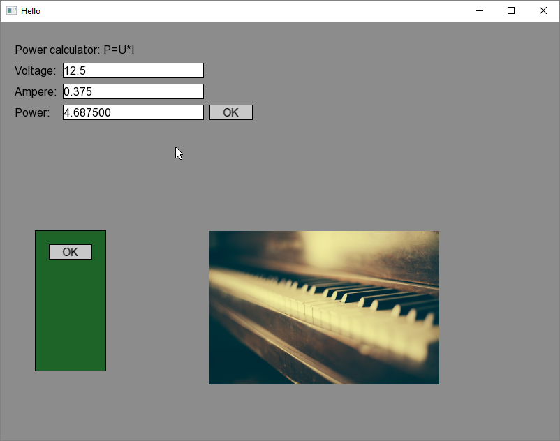

# ScorpionGUI

This is a small but pretty functional GUI library made with SFML. What is cool is that this enables me to make small scale desktop applications with C++. I got much inspiration from C# where you in the form designer could just drag and drop GUI-controls as needed. Prototyping the EditBox class took quite some time and effort. Not quite happy with it, but it is functional. Later I plan to make this handle multi line editing. I also wanted to have a designer box controler so that I could move and resize the attached control. All the controls are: Button, DesignerBox, EditBox, Image, Label, Shape. For this GUI-library to work I heavly depended on a shared context, or as I like to call it; A pointer bag. It is essently a struct that contains pointers to key pointers. Also I need to make a test project whilst developing the library. Main is loading the Form and then keeps running it (updating) till user shuts down the application. And Form1 inherits from GuiManager and this makes most of the scaffolding code hidden within. To add a control use AddControl(...) and with SetProperty(...) you set the new property to that control. The last part is to handle GUI-events and fill in some meaningful code. I.E: If Button1 is clicked please do-this-and-that.

Tags: C++, SFML, UI, Form, Shared Context
